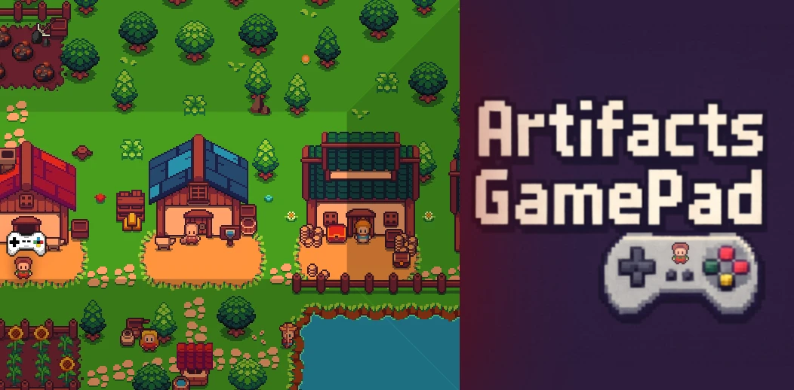

## Artifacts GamePad

A useful tool for playing Artifacts MMO with your controller.

[View Demo](https://waregalias.github.io/artifacts-gamepad/) ·
[Report Bug](https://github.com/Waregalias/artifacts-gamepad-controller/issues/new?labels=bug&template=bug-report---.md) ·
[Request Feature](https://github.com/Waregalias/artifacts-gamepad-controller/issues/new?labels=enhancement&template=feature-request---.md)

### Built With

* [![Next][Next.js]][Next-url]
* [![React][React.js]][React-url]

This is a [Next.js](https://nextjs.org) project bootstrapped with [`create-next-app`](https://nextjs.org/docs/app/api-reference/cli/create-next-app).

## Getting Started

Install dependencies:

```bash
npm install
```

Run desktop mode in development (Next + Electron):

```bash
npm run dev
```

Run web only:

```bash
npm run dev:web
```

### GitHub Pages demo

The demo is deployed automatically by GitHub Actions from `.github/workflows/deploy-pages.yml`.

Repository settings required once:

1. Go to `Settings` → `Pages`.
2. In `Build and deployment`, set `Source` to `GitHub Actions`.
3. Push to `main` (or run the workflow manually from `Actions`).

### Electron

Build Electron app (current platform):

```bash
npm run package
```

Build macOS packages:

```bash
npm run dist:mac
```

Build Windows packages:

```bash
npm run dist:win
```

Generated artifacts are written to `release/`.

### Login behavior

`play.artifactsmmo.com` authentication can fail in an iframe context because of browser security/cookie policies.
In desktop mode, this app embeds the game using Electron `webview` with a persistent partition for more reliable login/session handling than a standard iframe.
<!-- CONTRIBUTING -->
## Contributing

Contributions are what make the open source community such an amazing place to learn, inspire, and create. Any contributions you make are **greatly appreciated**.

If you have a suggestion that would make this better, please fork the repo and create a pull request. You can also simply open an issue with the tag "enhancement".
Don't forget to give the project a star! Thanks again!

1. Fork the Project
2. Create your Feature Branch (`git checkout -b feature/AmazingFeature`)
3. Commit your Changes (`git commit -m 'Add some AmazingFeature'`)
4. Push to the Branch (`git push origin feature/AmazingFeature`)
5. Open a Pull Request

<!-- MARKDOWN LINKS & IMAGES -->
<!-- https://www.markdownguide.org/basic-syntax/#reference-style-links -->
[Next.js]: https://img.shields.io/badge/next.js-000000?style=for-the-badge&logo=nextdotjs&logoColor=white
[Next-url]: https://nextjs.org/
[React.js]: https://img.shields.io/badge/React-20232A?style=for-the-badge&logo=react&logoColor=61DAFB
[React-url]: https://reactjs.org/
